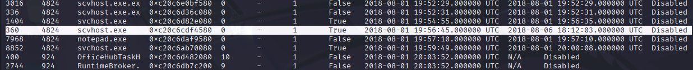

# 13Cubed Memory CTF

**DATE: Saturday, 26 July, 2025**

## 📂 Volatility Memory CTF – Day 26 | 13Cubed

**Memory Dump:** **`memdump.mem`**

**Volatility Version:** **`Volatility 3 Framework 2.26.2`**

**Profile:** **Win10x64**

**Analyst**: Jinay Shah ***(**a.k.a. Jynx**)***

---

## 🔍 Question 1 - Identify Malicious Process

**GOAL**→ ***Find the running rogue (malicious) process. The flag is the MD5 hash of its PID.***

- **Tool(s):** `pslist`
- **PID Identified:** `360`
- **Suspicious Trait:**
    1. **Typo squatting Attack**
        
        **Legitimate**: svchost.exe
        **Malicious**:  scvhost.exe  (s and v swapped!)
        
        - **Classic technique**: Slight misspelling to avoid detection
        - **Visual deception**: Looks legitimate at quick glance
        - **Process hiding**: Blends in with real svchost processes
    2. **0 threads**: Impossible for 5+ day runtime.
    3. **Wow64: True**: 32-bit process (potentially evasive).
    4. **Same parent (4824)**: Spawned by compromised process.
    5. **Perfect timing**: Terminated right before memory dump.
- **FLAG** [MD5 HASH - PID]: **`*e7b24b112a44fdd9ee93bdf998c6ca0e*`**



Parent process of common suspicious and the actual malware in our findings as well as the multiple svchost.exe:
**PPID** - **`4824` 
Process Name - explorer.exe**


---

## 💾 Question 2 - Dump and Analyze Memory of Rogue Process

**GOAL** → ***Find the running rogue (malicious) process and dump its memory to disk. You'll
find the 32-character flag within that process's memory.***

- **Tool(s):** `memdump`, `strings`, `base64 -d`
- **Base64 Encoded String Found:** `M2ExOTY5N2YyOTA5NWJjMjg5YTk2ZTQ1MDQ2Nzk2ODA=`
- **Decoded Flag:** `3a19697f29095bc289a96e4504679680`


---

## 🌐 Question 3 - MAC Address of Default Gateway

**GOAL** → ***What is the MAC address of this machine's default gateway? The flag is the MD5 hash of that MAC address in uppercase with dashes (-) as delimiters. Example:
01-00-A4-FB-AF-C2.***

- **Tool(s):** `printkey`, `dumpregistry`, `md5sum`
- **MAC Found:** `00-50-56-FE-D8-07`
- **Flag (MD5):** `6496d43b622a2ad241b4d08699320f4e`

```bash
# Print the NetworkList signatures to find the specific subkey
volatility3 -f memdump.mem windows.registry.printkey --key 
"Microsoft\Windows NT\CurrentVersion\NetworkList\Signatures\Unmanaged"
```


```bash
volatility3 -f memdump.mem windows.registry.printkey --key 
"Microsoft\Windows NT\CurrentVersion\NetworkList\Signatures\Unmanaged\010103
000F0000F0080000000F0000F0E3E937A4D0CD0A314266D2986CB7DED5D8B
43B828FEEDCEFFD6DE7141DC1D15D"
```


---

## 🗂️ Question 4 - Browser Cache File Path

**GOAL** → Find the full path of the browser cache created when an analyst visited
***"www.13cubed.com."*** The path will begin with "Users\." Convert the path to
uppercase. The flag is the MD5 hash of that string.

- **Tool(s):** -
- **Path (Uppercase):** -
- **Flag (MD5):** -


---

## 📦 Artifacts Collected

### 1. Registry Timestamp Discrepancy [10 Seconds]

| Artifact | Description | **Time Stamp** |
| --- | --- | --- |
| Registry        `0xc20c69d52040` | **Registry should NOT start before System** - this is actually an anomaly. How can a CHILD process initiate before the parent process. | **2018-08-01 19:20:10** |


Normally, the **System process (PID 4)** should **always** be the first process and have the earliest timestamp because:

1. **System process** is the kernel itself
2. **Registry process** is created BY the System process
3. **Parent-child relationship**: Registry (PID 68) has PPID 4 (System as parent)

This **10-second discrepancy is suspicious** and warrants further investigation. While it could be explained by technical issues, it's also a potential indicator of:

- **Rootkit activity**
- **Process manipulation**
- **Anti-forensics techniques**
- **System compromise**

### 2. svchost.exe suspicious

| Artifact | Description | Path/Hash |
| --- | --- | --- |
| **svchost.exe** | - ZERO Threads [Critical]
- 5 days later the process terminated but then how was the current memory dump captured while other processes are still running 
- **PID < PPID**: Child PID lower than parent PID [Unusual] | `0xc20c6bae9580` |


### **Most Likely Scenarios:**

1. **Process Hollowing**
    - Malware created legitimate svchost.exe
    - Replaced its memory with malicious code
    - Left zombie process object
2. **Rootkit Activity**
    - Rootkit manipulating process visibility
    - Hiding active malicious processes
    - Showing terminated processes as decoy
3. **Memory Corruption**
    - Process object partially corrupted
    - Memory dump captured during termination
    - Data structure inconsistencies

### 3. Microsoft Edge.

| Artifact | Description | Path/Hash |
| --- | --- | --- |
| **MicrosoftEdge.** | - **ZERO Threads** [highly suspicious for a browser] for **3:57 mins**. | `0xc20c6debd400` |


Possible Explanations for 0 Threads

**1. Normal Termination Artifact (Possible)**

- `Edge crashed or was force-killed
- Memory dump captured during cleanup
- Thread structures already deallocated
- Process object not yet removed`

**2. Process Injection (Suspicious)**

- `Malware injected into legitimate Edge process
- Ran malicious code for 4 minutes
- Cleaned up threads during exit
- Left process shell behind`

**3. Browser Crash (Normal)**

- `Edge encountered error and crashed
- Abnormal termination left 0 threads
- Windows cleanup process ongoing
- Memory dump timing caught transition`

### 4. cmd.exe

| Artifact | Description | Path/Hash |
| --- | --- | --- |
| **cmd.exe** | - **ZERO Threads** [highly suspicious for a terminal] running for **9:04 mins**. | `0xc20c6e495080` |


**9-Minute Runtime Impossibility:**

**Active for 9 minutes**: Someone was using it

**Zero threads**: Process can't function without threads

**Still responsive**: Had to be processing commands

**Clean termination**: Got proper exit time

### **Most Likely Scenarios:**

### **1. Process Hollowing (High Probability)**

Malware created legitimate cmd.exe process
- Suspended original cmd.exe threads
- Injected malicious code using different threading
- Ran malware for 9 minutes disguised as cmd.exe
- Cleaned up all original threads during exit

### **2. Command Injection Attack**

Attacker gained cmd.exe access
- Used it to run malicious commands
- Advanced malware manipulated thread visibility
- Anti-forensics technique to hide activity

### **3. Rootkit Thread Hiding**

cmd.exe was actively used by attacker
- Rootkit hid real thread count from system
- Process appeared "inactive" while running malicious commands
- Sophisticated evasion technique

## 📅 Timeline Correlation

```bash
19:49:18 - cmd.exe ends (9-minute session)
19:49:19 - svchost.exe starts (0 seconds runtime)
19:49:21 - svchost.exe starts (1 second runtime)

19:50:30 - Bubbles.scr #(screensaver?)
19:52:16-20 - Multiple svchost.exe.ex processes
19:52:29-31 - MORE scvhost.exe.ex processes
19:56:45 - Main `scvhost.exe` starts #(THE BIG ONE - 5 days!)
```

---
